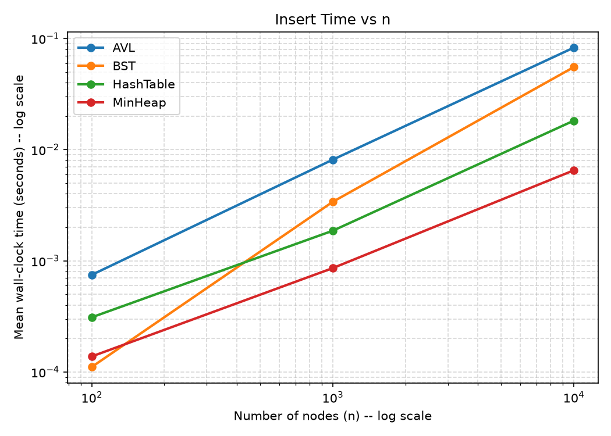
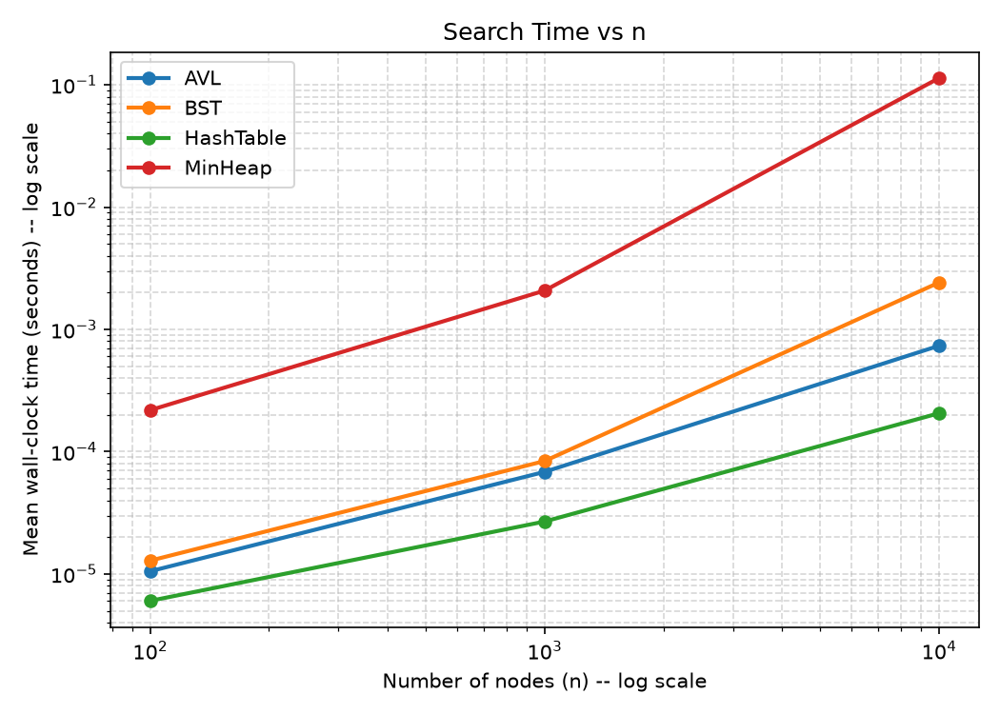
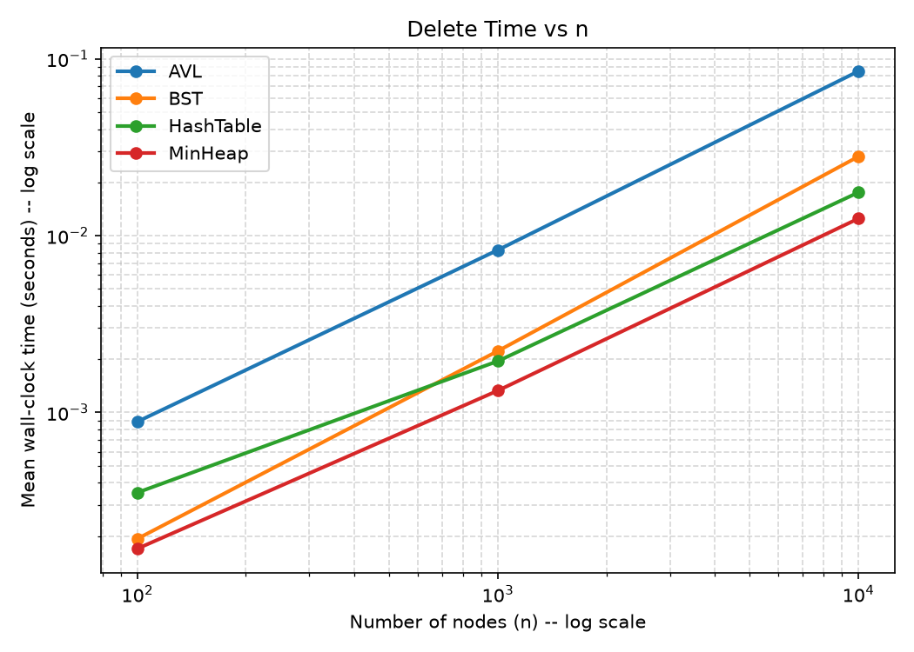
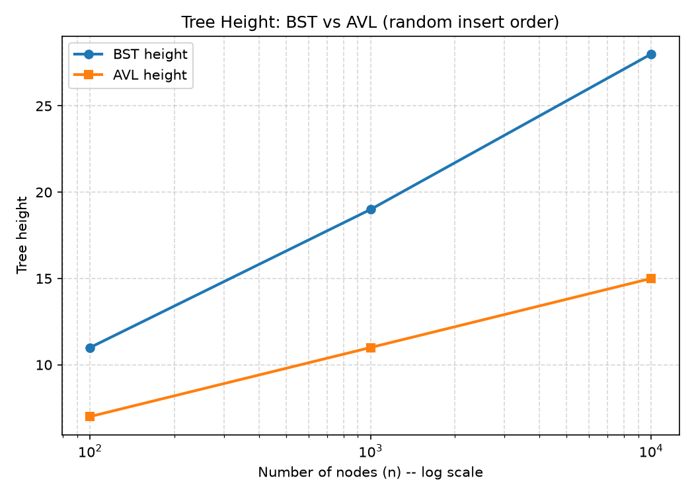
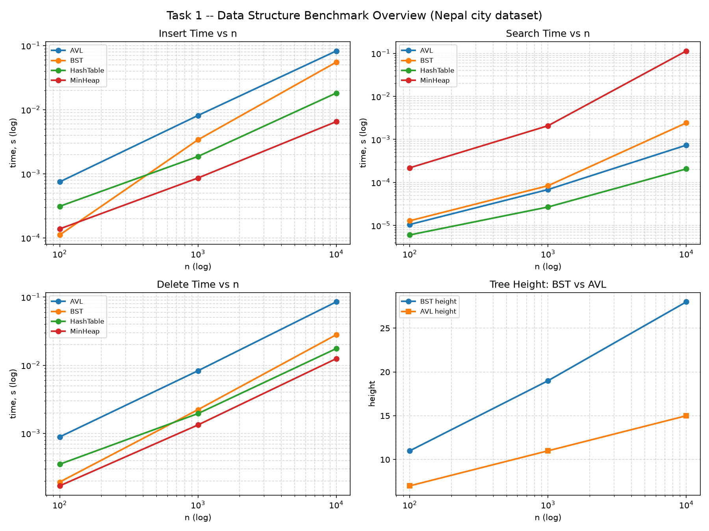

# Task 1 -- Advanced Data Structures: Benchmark Report

Auto-generated by `benchmark.py`. Dataset: cities of Nepal (see `nepal_cities.py`), keyed on distance (km) from Kathmandu. Contains theoretical complexity, empirical timings (wall-clock, mean of 3 repeats), and observations drawn directly from the measured results below.

## 1. Theoretical Complexity (Big-O)

| Structure   | Insert (avg)   | Search (avg)   | Delete (avg)   | Insert (worst)   | Search (worst)   | Delete (worst)   | Notes                                                    |
|-------------|----------------|----------------|----------------|------------------|------------------|------------------|----------------------------------------------------------|
| BST         | O(log n)       | O(log n)       | O(log n)       | O(n)             | O(n)             | O(n)             | Degenerates to a linked list on sorted/adversarial input |
| AVL Tree    | O(log n)       | O(log n)       | O(log n)       | O(log n)         | O(log n)         | O(log n)         | Guaranteed balanced; extra rotation overhead per update  |
| Min-Heap    | O(log n)       | O(n)*          | O(log n)       | O(log n)         | O(n)             | O(log n)         | *Arbitrary search is O(n); only min is O(1) via peek     |
| Hash Table  | O(1)           | O(1)           | O(1)           | O(n)             | O(n)             | O(n)             | Worst case only if hash function collides badly          |

## 2. Empirical Results

### n = 100

Example cities sampled for search/delete timing: Ilam, Inaruwa, Dhankuta (2), Dhangadhi, Terhathum, ...

| Structure   | Insert (mean)   | Search (mean)   | Delete (mean)   | Tree Height   |
|-------------|-----------------|-----------------|-----------------|---------------|
| BST         | 111.1 탎        | 12.9 탎         | 192.9 탎        | 11            |
| AVL Tree    | 748.1 탎        | 10.5 탎         | 886.5 탎        | 7             |
| Min-Heap    | 138.1 탎        | 218.8 탎        | 169.6 탎        | n/a           |
| Hash Table  | 310.5 탎        | 6.0 탎          | 352.0 탎        | n/a           |

- Fastest **search** at n=100: **HashTable** (6.0 탎)

- Hash table load factor at n=100: 0.391 (max chain length 1)

### n = 1,000

Example cities sampled for search/delete timing: Beni (2), Darchula (8), Gaur (12), Manma (11), Terhathum (11), ...

| Structure   | Insert (mean)   | Search (mean)   | Delete (mean)   | Tree Height   |
|-------------|-----------------|-----------------|-----------------|---------------|
| BST         | 3.395 ms        | 83.9 탎         | 2.225 ms        | 19            |
| AVL Tree    | 8.129 ms        | 68.4 탎         | 8.293 ms        | 11            |
| Min-Heap    | 860.2 탎        | 2.077 ms        | 1.329 ms        | n/a           |
| Hash Table  | 1.865 ms        | 26.9 탎         | 1.951 ms        | n/a           |

- Fastest **search** at n=1,000: **HashTable** (26.9 탎)

- Hash table load factor at n=1,000: 0.488 (max chain length 1)

### n = 10,000

Example cities sampled for search/delete timing: Jomsom (30), Jumla (125), Damauli (14), Kanchanpur (56), Baitadi (26), ...

| Structure   | Insert (mean)   | Search (mean)   | Delete (mean)   | Tree Height   |
|-------------|-----------------|-----------------|-----------------|---------------|
| BST         | 55.228 ms       | 2.419 ms        | 28.002 ms       | 28            |
| AVL Tree    | 82.650 ms       | 735.2 탎        | 85.107 ms       | 15            |
| Min-Heap    | 6.515 ms        | 113.556 ms      | 12.487 ms       | n/a           |
| Hash Table  | 18.216 ms       | 206.3 탎        | 17.555 ms       | n/a           |

- Fastest **search** at n=10,000: **HashTable** (206.3 탎)

- Hash table load factor at n=10,000: 0.61 (max chain length 1)

## 3. Tree Height Comparison (BST vs AVL)

|     n |   BST height |   AVL height |
|-------|--------------|--------------|
|   100 |           11 |            7 |
|  1000 |           19 |           11 |
| 10000 |           28 |           15 |

## 4. Charts

## 5. Observations (auto-summarised from the data above)

- At the largest tested size (n=10,000), **HashTable** gave the fastest search -- consistent with its O(1) average-case theoretical complexity.

- **AVL** had the slowest insert time at n=10,000. For the AVL tree specifically, this reflects the cost of rebalancing (rotations) on every insert -- the "hidden constant factor" behind its O(log n) guarantee.

- Tree height at n=10,000: BST reached height 28, AVL stayed at height 15. This demonstrates AVL's self-balancing keeping the tree shallower, even though the *random* insertion order used here kept the plain BST from degenerating to its true worst case (a sorted-input BST would be far taller).

- The Min-Heap's search time is consistently the slowest of the four structures, because a heap only guarantees fast access to the minimum element -- looking up an arbitrary city requires an O(n) linear scan. This supports using a heap only for priority-queue access patterns (e.g. "next nearest city to visit on the route"), not for general lookups.
