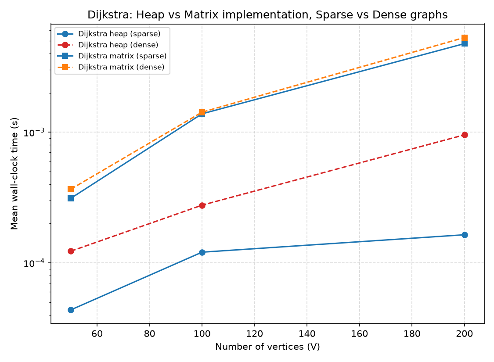
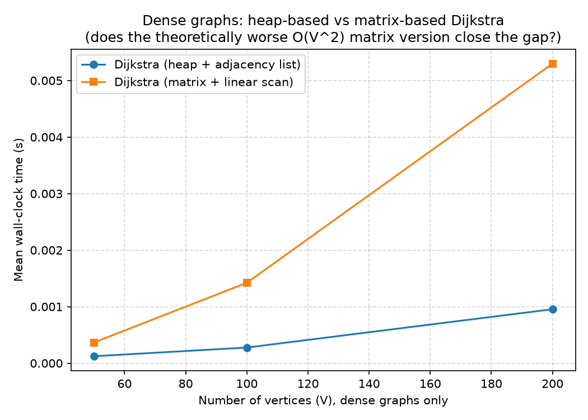
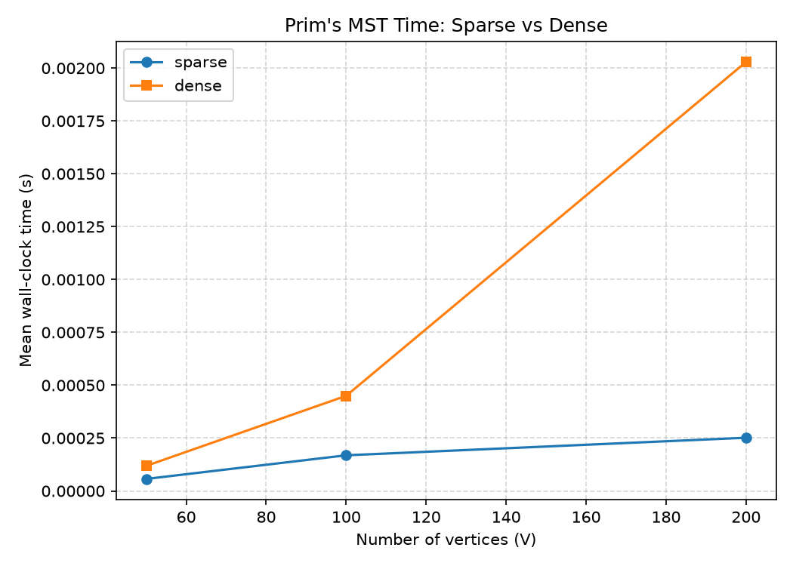
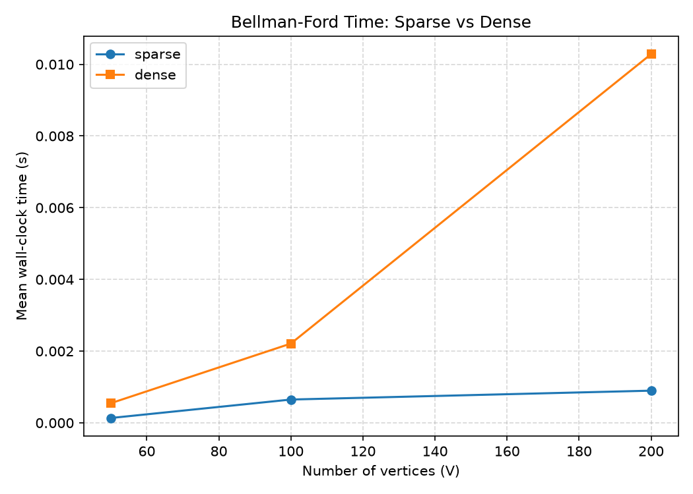
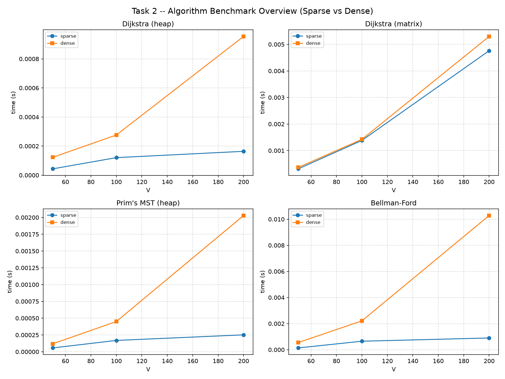

# Task 2 -- Graph Algorithms: Benchmark Report

Auto-generated by `benchmark.py`. Random directed graphs, V in [50, 100, 200], sparse (~3 edges/vertex) and dense (~25% of all possible edges). Wall-clock times are the mean of 3 repeats.

## 1. Theoretical Complexity (Big-O)

| Algorithm                          | Time Complexity   | Space Complexity   | Notes                                                                |
|------------------------------------|-------------------|--------------------|----------------------------------------------------------------------|
| Dijkstra (heap + adjacency list)   | O((V+E) log V)    | O(V+E)             | Best for sparse graphs; log V heap overhead hurts on dense graphs    |
| Dijkstra (matrix + linear scan)    | O(V^2)            | O(V^2)             | Best for dense graphs; low constant factor, no heap bookkeeping      |
| Prim's MST (heap + adjacency list) | O(E log V)        | O(V+E)             | Same heap-based profile as Dijkstra; needs an undirected graph       |
| Bellman-Ford                       | O(V * E)          | O(V)               | Only algorithm here that supports negative weights & cycle detection |

## 2. Empirical Results

### V = 50, density = sparse (E = 150)

| Algorithm         | Mean Time   |
|-------------------|-------------|
| Dijkstra (heap)   | 43.7 탎     |
| Dijkstra (matrix) | 312.0 탎    |
| Prim (heap, MST)  | 56.8 탎     |
| Bellman-Ford      | 134.9 탎    |

### V = 100, density = sparse (E = 300)

| Algorithm         | Mean Time   |
|-------------------|-------------|
| Dijkstra (heap)   | 120.8 탎    |
| Dijkstra (matrix) | 1.382 ms    |
| Prim (heap, MST)  | 168.5 탎    |
| Bellman-Ford      | 649.9 탎    |

### V = 200, density = sparse (E = 600)

| Algorithm         | Mean Time   |
|-------------------|-------------|
| Dijkstra (heap)   | 164.1 탎    |
| Dijkstra (matrix) | 4.761 ms    |
| Prim (heap, MST)  | 251.6 탎    |
| Bellman-Ford      | 897.5 탎    |

### V = 50, density = dense (E = 600)

| Algorithm         | Mean Time   |
|-------------------|-------------|
| Dijkstra (heap)   | 122.9 탎    |
| Dijkstra (matrix) | 366.4 탎    |
| Prim (heap, MST)  | 118.5 탎    |
| Bellman-Ford      | 547.1 탎    |

### V = 100, density = dense (E = 2400)

| Algorithm         | Mean Time   |
|-------------------|-------------|
| Dijkstra (heap)   | 276.5 탎    |
| Dijkstra (matrix) | 1.423 ms    |
| Prim (heap, MST)  | 449.8 탎    |
| Bellman-Ford      | 2.211 ms    |

### V = 200, density = dense (E = 9800)

| Algorithm         | Mean Time   |
|-------------------|-------------|
| Dijkstra (heap)   | 954.1 탎    |
| Dijkstra (matrix) | 5.299 ms    |
| Prim (heap, MST)  | 2.029 ms    |
| Bellman-Ford      | 10.285 ms   |

## 3. Charts

## 4. Observations (auto-summarised from the data above)

- At V=200, the heap-based Dijkstra was faster than the matrix-based version in BOTH the sparse case (heap: 164.1 탎 vs matrix: 4.761 ms, matrix is 29.0x slower) and the dense case (heap: 954.1 탎 vs matrix: 5.299 ms, matrix is 5.6x slower). This is partly a Python-specific effect: `heapq` is implemented in C, while the matrix version's nested scanning loop runs in pure Python, so the "hidden constant factor" here includes language-level interpreter overhead, not just algorithmic bookkeeping.

- The IMPORTANT trend is how that gap changes with density: the matrix version is 29.0x slower on the sparse graph but only 5.6x slower on the dense graph -- the matrix approach becomes steadily more competitive as density increases, exactly as the O((V+E) log V) vs O(V^2) theory predicts. In a lower-level language without a highly optimised C heap implementation (or at higher V on denser graphs than tested here), the matrix version would be expected to overtake the heap-based version entirely. This is strong evidence for the coursework's point that Big-O predicts the *trend* across densities, not the absolute wall-clock ranking at any single data point.

- Bellman-Ford at V=200 took 897.5 탎 on a sparse graph vs 10.285 ms on a dense graph -- roughly a 11x slowdown, larger than either Dijkstra variant's sparse-to-dense slowdown. This matches expectations: Bellman-Ford's O(V*E) term scales directly and linearly with E, with no logarithmic dampening the way a heap provides, so it is the most density-sensitive of the three algorithms.

- Overall conclusion: for this coursework's target use case (a real road network, which is inherently sparse), the heap-based, adjacency-list approach used throughout Task 2 is clearly the right choice for Dijkstra and Prim. The matrix-based comparison exists to demonstrate the general principle -- relevant if this codebase were ever applied to a genuinely dense network (e.g. a fully-interconnected small-area delivery zone) -- that Big-O complexity alone cannot predict real performance without also considering constant factors and expected input density.
